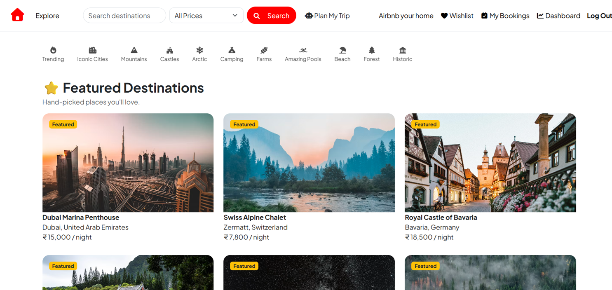

# Wanderlust

Wanderlust is a full-stack travel accommodation platform built using the MERN stack. The project was inspired by platforms like Airbnb but extends beyond accommodation booking by integrating AI-powered travel planning, destination weather insights, interactive maps, and host management tools into a single application.

The goal of the project was not only to recreate a booking platform but also to build a practical web application that demonstrates modern full-stack development concepts including authentication, RESTful APIs, database design, cloud storage, third-party API integration, and deployment.

## Live Demo

https://wanderlust-kxk4.onrender.com/listings

---
## 📸 Project Preview



## Features

### User Features

- User registration and login
- Secure authentication using Passport.js
- Browse and search listings
- Filter listings by price
- View detailed property information
- Add listings to wishlist
- Book accommodations
- View booking history
- Leave ratings and reviews
- AI-powered Trip Planner
- AI Travel Assistant
- Real-time destination weather
- Interactive location maps

### Host Features

- Create new property listings
- Upload listing images through Cloudinary
- Edit existing listings
- Delete listings
- Manage bookings
- Dashboard with listing and review management

---

## Technologies Used

### Frontend

- HTML5
- CSS3
- Bootstrap 5
- JavaScript
- EJS

### Backend

- Node.js
- Express.js

### Database

- MongoDB Atlas
- Mongoose

### Authentication

- Passport.js
- Express Session

### APIs & Services

- Cloudinary
- OpenWeather API
- Gemini API
- Geoapify API
- Leaflet.js

---

## Project Structure

```
controllers/
models/
routes/
views/
public/
middlewares/
utils/
init/
```

---

## Installation

Clone the repository

```bash
git clone https://github.com/bhoomi-2406/wanderlust.git
```

Move into the project folder

```bash
cd wanderlust
```

Install dependencies

```bash
npm install
```

Create a `.env` file and add the following variables

```env
ATLASDB_URL=
CLOUD_NAME=
CLOUD_API_KEY=
CLOUD_API_SECRET=
WEATHER_API_KEY=
GEMINI_API_KEY=
GEOAPIFY_API_KEY=
```

Run the application

```bash
npm start
```

---

## Future Improvements

- Payment Gateway Integration
- Availability Calendar
- Email Notifications
- Admin Panel
- Personalized AI Recommendations
- Multi-language Support
- Mobile Application

---

## Author

**Bhoomi Srivastava**

B.Tech Information Technology Student

Full Stack MERN Developer

GitHub: https://github.com/bhoomi-2406